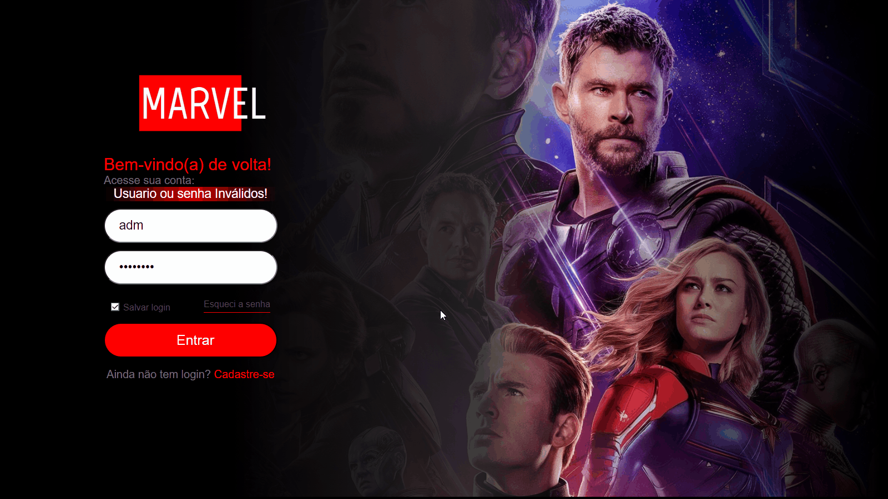

# Portal da Marvel | Desafio Front-End
## Descrição
Site sobre os personagens, filmes e Hqs da Marvel feito usando React e as APIs
<a href="https://developer.marvel.com/" target="_blank">Marvel</a> e
<a href="https://www.themoviedb.org/" target="_blank">TheMovieDB</a>
 
Usuário: adm 
 
Senha: password
##

##

Responsividade

##

Login

##

  
  <a href="https://portal-marvel.herokuapp.com" target="_blank">Site Hospedado na heroku<a/>
  
  <a href="https://github.com/EnzoWu479" target="_blank">GitHub<a/>
  
  <a href="https://www.linkedin.com/in/enzo-wu-41b2ba22a/" target="_blank">Linkedin<a/>

